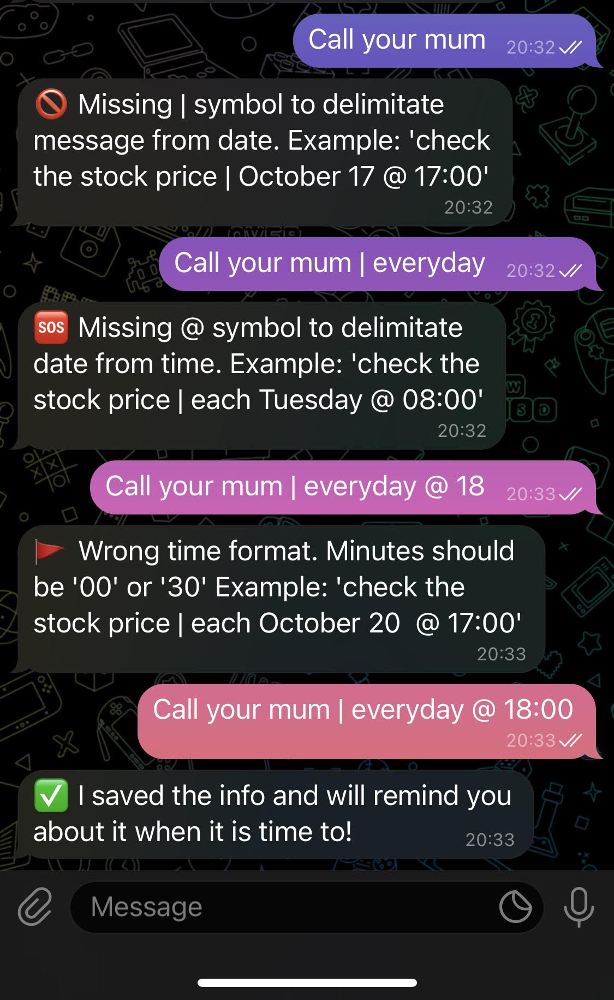

# Remindme

A Telegram bot to remind you things you don't want to forget

## Why a bot?

I constantly need to remind myself about a weekly thing to do, a daily good habit to follow or a specific event that will occur later on in the year. Sure I could set some alarms, but that does not scale well, or I could put them in the default Mac Notes app. But how do I remember to look through the notes? 

So I thought about creating a Telegram Bot (no fancy thing, it just boils down to a http handler the Telegram API sends the user message to) named `@remindme_later_bot` that I can send a reminder to and that will send it back to me on the specified (recurrent) date and time.

## iOS demo

## WIP

I am currently working on having [a Node app](https://github.com/GregVes/remindme-db-checker) that checks db in an fix interval of time to get matching reminders and send them to != chats. So basically when sending reminders to the bot at the moment, it won't remind yet (messages are only stored in db)

## Stack stuff

The Golang server and the Postgresql database are running in containers on my Debian server and a Drone instance is used for CI/CD
